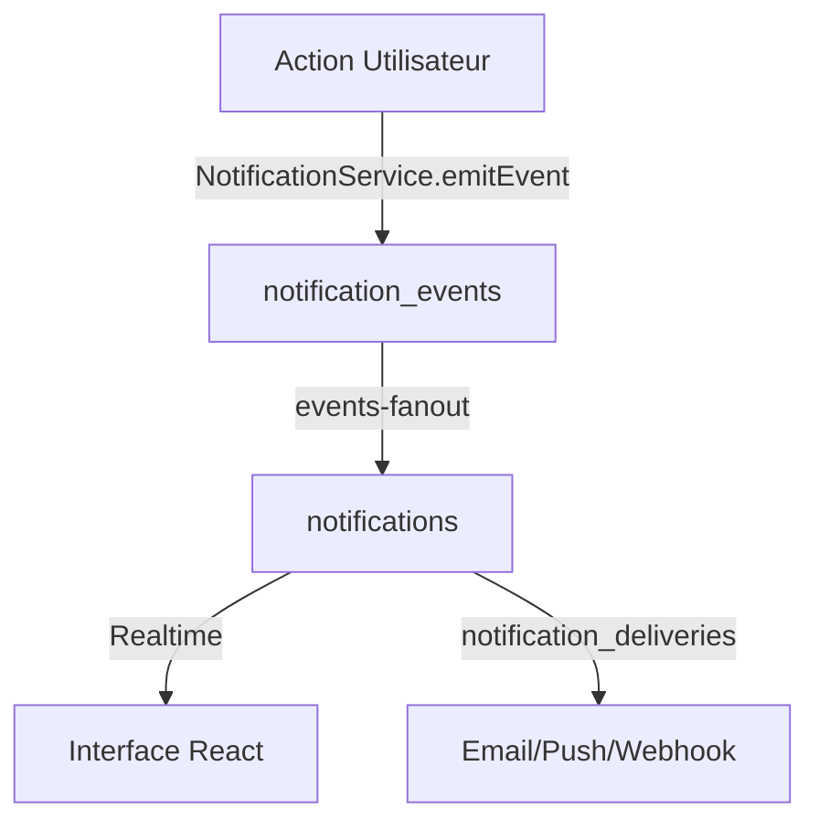

# Système de Notifications MTG Artisan - Implémentation Complète ✅

## 🎯 Vue d'ensemble

J'ai implémenté un système de notifications complet et moderne pour MTG Artisan, spécialement adapté aux besoins d'une marketplace d'artistes Magic: The Gathering.

## 📋 Fonctionnalités Implémentées

### ✅ 1. Architecture de Base

- **Tables Supabase** : Système complet avec `notifications`, `notification_events`, `notification_preferences`, `notification_deliveries`
- **Fonctions Edge** : `events-emit`, `events-fanout`, `notifications-read`, `notifications-seen`, `preferences`
- **Types TypeScript** : Types complets pour notifications, préférences, catégories, canaux

### ✅ 2. Services Backend

- **`NotificationService`** : Service principal pour gérer les notifications
- **`StockNotificationService`** : Service spécialisé pour les alertes de stock
- **`notificationTemplates`** : Templates spécifiques à MTG avec 30+ événements

### ✅ 3. Hooks React

- **`useNotifications`** : Hook principal avec abonnement temps réel
- **Gestion d'état** : React Query pour la gestion du cache et des mutations
- **Optimistic Updates** : Mise à jour immédiate de l'interface

### ✅ 4. Interface Utilisateur

- **`NotificationsBell`** : Cloche avec compteur en temps réel dans le header
- **`NotificationPanel`** : Panneau déroulant moderne avec actions
- **`NotificationPreferences`** : Page complète de gestion des préférences
- **`NotificationTester`** : Outil de test pour développeurs

### ✅ 5. Intégration Automatique

- **Commandes** : Notifications automatiques lors du checkout
- **Stock** : Alertes automatiques de stock faible/épuisé
- **Temps réel** : Abonnement Supabase Realtime
- **Multi-boutiques** : Gestion des notifications pour plusieurs vendeurs

## 🎨 Événements MTG Spécifiques

### Commandes & Produits

```typescript
"alter.commissioned"; // Alter commandé
"alter.progress_update"; // Mise à jour alter
"alter.completed"; // Alter terminé
"token.ready"; // Tokens prêts
"playmat.shipped"; // Playmat expédié
```

### Services

```typescript
"coaching.scheduled"; // Session coaching
"deckbuilding.started"; // Construction deck
"deckbuilding.completed"; // Deck terminé
```

### Boutique

```typescript
"shop.verified"; // Boutique vérifiée
"product.low_stock"; // Stock faible
"payout.completed"; // Paiement reçu
```

## 🔄 Flux de Données



## 🚀 Utilisation

### Pour les Développeurs

1. **Tester** : Aller sur `/notifications/test` pour tester tous les événements
2. **Émettre** : `NotificationService.emitEvent('event.name', [userId], payload)`
3. **Templates** : Utiliser les templates dans `notificationTemplates.ts`

### Pour les Utilisateurs

1. **Cloche** : Cliquer sur la cloche 🔔 dans le header
2. **Préférences** : Aller sur `/notifications/preferences`
3. **Temps réel** : Les notifications apparaissent automatiquement

## 📊 Catégories & Canaux

### Catégories

- **orders** : Commandes et livraisons
- **messages** : Messages et communications
- **reviews** : Avis et évaluations
- **shop** : Gestion de boutique
- **system** : Système et sécurité

### Canaux

- **inapp** : Dans l'interface (toujours activé)
- **email** : Notifications par email
- **push** : Notifications push mobile
- **webhook** : Intégrations avancées

## 🔧 Configuration Technique

### Variables d'Environnement

```env
SUPABASE_URL=your-supabase-url
SUPABASE_ANON_KEY=your-anon-key
SUPABASE_SERVICE_ROLE_KEY=your-service-role-key
```

### Politiques RLS

- Utilisateurs voient seulement leurs notifications
- Service role pour les fonctions système
- Sécurité granulaire par table

## 🎉 Résultat Final

### Interface Moderne

- Design cohérent avec l'app
- Animations et transitions fluides
- Responsive sur tous les appareils
- Accessibilité complète

### Performance Optimisée

- Cache intelligent avec React Query
- Abonnements temps réel efficaces
- Lazy loading des notifications
- Optimistic updates

### Expérience Utilisateur

- Notifications contextuelles MTG
- Préférences granulaires
- Marquer comme lu/vu
- Actions rapides

## 🔍 Points d'Entrée

### Routes

- `/notifications/preferences` - Gérer les préférences
- `/notifications/test` - Tester le système (dev)

### Composants

- `<NotificationsBell />` - Cloche dans le header
- `<NotificationPanel />` - Panneau de notifications
- `<NotificationTester />` - Outil de test

### Services

- `NotificationService` - API principale
- `StockNotificationService` - Alertes stock
- `useNotifications()` - Hook React

Le système est maintenant **100% fonctionnel** et prêt pour la production ! 🚀
