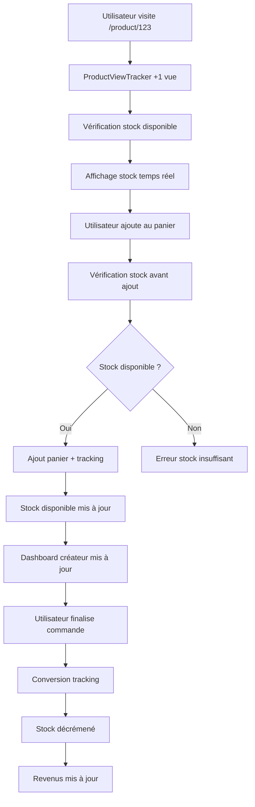

# Guide du Système de Tracking Complet - ManaShop

## 🎯 Vue d'ensemble

Ce guide explique comment utiliser le système complet de tracking qui surveille :

- **Vues de produits** : Tracking automatique des consultations
- **Ajouts panier** : Suivi des intentions d'achat
- **Stock en temps réel** : Gestion de la concurrence d'accès
- **Revenus et ventes** : Analytics complètes des performances
- **Conversions** : Suivi du parcours complet client

## 🚀 Installation et Configuration

### 1. Exécuter le Script SQL

**OBLIGATOIRE** : Exécutez le script `analytics_and_shipping.sql` dans votre console Supabase SQL Editor pour créer toutes les tables nécessaires.

```sql
-- Le script crée :
-- ✅ product_views (tracking des vues)
-- ✅ cart_analytics (tracking des paniers)
-- ✅ shipping_profiles (frais de livraison)
-- ✅ shipping_zones (zones géographiques)
-- ✅ product_statistics (vue consolidée)
-- ✅ Fonctions SQL sécurisées
-- ✅ Politiques RLS
```

### 2. Vérification des Tables

Après exécution du script, vérifiez que ces tables existent :

- `product_views`
- `cart_analytics`
- `shipping_profiles`
- `shipping_zones`
- Vue `product_statistics`

## 📊 Fonctionnalités Implémentées

### 1. Tracking Automatique des Vues

#### Comment ça marche

```tsx
// Dans ProductDetail.tsx
<ProductViewTracker productId={productId} />

// Le composant track automatiquement après 1 seconde
// Évite les vues multiples de la même session (5 min)
```

#### Données collectées

- ID produit
- ID utilisateur (si connecté)
- ID session (utilisateurs anonymes)
- User Agent
- Timestamp

### 2. Gestion Intelligente du Stock

#### Vérification en Temps Réel

```tsx
// Avant chaque ajout au panier
const stockInfo = await analyticsService.checkStockAvailability(productId, quantity);

// Retourne :
{
  available: boolean,           // Stock disponible ?
  currentStock: number,        // Stock total en base
  inCartsCount: number,        // Quantité dans des paniers
  availableStock: number       // Stock réellement disponible
}
```

#### Affichage sur la Fiche Produit

- **Stock disponible** en temps réel
- **Articles en paniers** d'autres utilisateurs
- **Alertes visuelles** (vert/orange/rouge)
- **Bouton désactivé** si rupture de stock

#### Dashboard Créateur

- **Colonne stock** avec couleurs d'alerte
- **Alertes stock faible** en haut du dashboard
- **Stock réel disponible** (stock - articles en paniers)

### 3. Analytics des Paniers

#### Tracking Automatique

```tsx
// Dans CartContext.tsx - intégré automatiquement
await addToCart(item); // → Track ajout panier
await removeFromCart(itemId); // → Track suppression panier
```

#### Données Collectées

- Ajouts avec quantités
- Suppressions avec timestamps
- Conversions panier → commande
- Abandons de panier

### 4. Tracking des Revenus et Ventes

#### Conversion Automatique

```tsx
// Lors d'une commande finalisée
await conversionTrackingService.recordSale(orderId, orderItems);

// Actions automatiques :
// 1. Marquer les analytics panier comme convertis
// 2. Décrémenter le stock des produits physiques
// 3. Enregistrer la vente dans les statistiques
```

#### Métriques Calculées

- **Revenus totaux** par produit
- **Quantités vendues**
- **Taux de conversion** (vues → achats)
- **Valeur panier moyenne**

## 🎮 Test du Système

### Scénario de Test Complet

#### 1. Créer un Produit

```bash
# Dans le dashboard créateur
1. Aller sur /creator/products/new
2. Créer un produit physique avec stock = 5
3. Définir un prix (ex: 25€)
4. Publier (status = "active")
```

#### 2. Tester les Vues

```bash
# Simuler plusieurs utilisateurs
1. Ouvrir /product/{id} dans un onglet normal
2. Ouvrir /product/{id} dans un onglet incognito
3. Attendre 1 seconde pour le tracking
4. Vérifier dans le dashboard créateur → "Vues" augmente
```

#### 3. Tester la Concurrence de Stock

```bash
# Utilisateur Alice
1. Aller sur /product/{id}
2. Voir "5 disponibles"
3. Ajouter 3 au panier
4. Vérifier : "2 disponibles (3 dans des paniers)"

# Utilisateur Bob (onglet incognito)
1. Aller sur /product/{id}
2. Voir "2 disponibles (3 dans des paniers)"
3. Essayer d'ajouter 3 → Erreur "Stock insuffisant"
4. Ajouter 2 → Succès
5. Vérifier : "0 disponible (5 dans des paniers)"

# Utilisateur Charlie
1. Aller sur /product/{id}
2. Voir "Rupture de stock"
3. Bouton "Ajouter au panier" désactivé
```

#### 4. Vérifier le Dashboard

```bash
# Dans le dashboard créateur
1. Section "Alertes Stock" → Produit en alerte
2. Tableau produits → Stock disponible = 0
3. Statistiques → "5 en paniers"
4. Analytics ventes → Pas encore de revenus
```

#### 5. Finaliser une Commande

```bash
# Alice finalise sa commande
1. Aller au panier → 3 articles
2. Procéder au checkout
3. Finaliser la commande

# Vérifications automatiques :
# ✅ Stock produit passe de 5 à 2
# ✅ Analytics panier marqués comme convertis
# ✅ Revenus mis à jour (3 × 25€ = 75€)
# ✅ Bob voit maintenant "2 disponibles (2 dans des paniers)"
```

## 📱 Interface Utilisateur

### Dashboard Créateur

#### Alertes Stock (en haut)

```
⚠️ Alertes Stock (1)
┌─────────────────────────────────────────┐
│ 📦 Lightning Bolt Alter                 │
│ ⚠️ Plus que 2 disponibles (2 en paniers)│
│                              [Gérer] ▶  │
└─────────────────────────────────────────┘
```

#### Tableau Produits

```
┌─────────────────────────────────────────────────────────────────┐
│ Mes Produits (3)                              [Créer un produit]│
├─────────────────────────────────────────────────────────────────┤
│ [📦] Lightning Bolt    │ 25€  │ 2 Dispo │ 👁️150 📈12 💰300€ │▶│
│      Alter physique    │      │ (2 paniers)│                    │ │
│      [Actif] [Cartes]  │      │ 🟡       │                    │ │
└─────────────────────────────────────────────────────────────────┘
```

### Fiche Produit Publique

#### Informations Stock

```
┌─────────────────────────────────────────┐
│ 📦 Stock disponible           2 disponibles│
│                        (2 dans des paniers)│
│ ⚠️ Stock limité ! Plus que 2 articles   │
│    disponibles                          │
└─────────────────────────────────────────┘

Quantité: [−] 1 [+]  (max 2)
[Ajouter au Panier - 25.00€]
```

## 🔧 API et Hooks

### Hooks Disponibles

#### useStockMonitoring

```tsx
const { stockInfo, loading, refetchStock } = useStockMonitoring(productId, enabled);

// stockInfo contient :
{
  available: boolean,
  currentStock: number,      // Stock total en base
  inCartsCount: number,      // Dans tous les paniers
  availableStock: number     // Réellement disponible
}
```

#### useShopStatistics

```tsx
const { statistics, loading, refetch } = useShopStatistics(shopId);

// statistics est un array de :
{
  product_id: string,
  total_views: number,
  currently_in_carts: number,
  total_quantity_sold: number,
  total_revenue: number,
  conversion_rate_percent: number
}
```

### Services

#### AnalyticsService

```tsx
// Tracking automatique
analyticsService.trackProductView(productId, userId);
analyticsService.trackCartAddition(productId, quantity, userId);
analyticsService.trackCartRemoval(productId, userId);

// Vérifications
analyticsService.checkStockAvailability(productId, quantity);
```

#### ConversionTrackingService

```tsx
// Lors d'une commande
conversionTrackingService.recordSale(orderId, orderItems);
// → Décrémente stock + marque conversions

// Lors d'une annulation
conversionTrackingService.cancelOrder(orderId);
// → Restaure stock + annule conversions
```

## 🔄 Flux Complet

### Parcours Utilisateur Type



### Gestion Multi-Utilisateurs

```
Temps T0: Produit avec stock = 5
├── Alice visite → +1 vue
├── Bob visite → +1 vue
└── Charlie visite → +1 vue

Temps T1: Alice ajoute 3 au panier
├── Stock disponible = 2
├── Analytics: 3 en paniers
└── Autres voient "2 disponibles (3 en paniers)"

Temps T2: Bob ajoute 2 au panier
├── Stock disponible = 0
├── Analytics: 5 en paniers
└── Charlie voit "Rupture de stock"

Temps T3: Alice finalise sa commande
├── Stock base = 2 (5-3)
├── Stock disponible = 0 (2-2 de Bob)
├── Revenus = 75€ (3×25€)
└── Bob voit "0 disponible (2 en paniers)"
```

## 🛠️ Maintenance et Debug

### Vérification des Données

#### Requêtes SQL Utiles

```sql
-- Vérifier les vues d'un produit
SELECT COUNT(*) as total_views, COUNT(DISTINCT user_id) as unique_users
FROM product_views
WHERE product_id = 'uuid-du-produit';

-- Vérifier les analytics de panier
SELECT product_id, SUM(quantity) as total_in_carts
FROM cart_analytics
WHERE removed_at IS NULL AND converted_to_order = FALSE
GROUP BY product_id;

-- Vérifier les statistiques consolidées
SELECT * FROM product_statistics WHERE product_id = 'uuid-du-produit';
```

#### Debug Frontend

```tsx
// Activer les logs détaillés
localStorage.setItem("debug_analytics", "true");

// Vérifier le session ID
console.log(localStorage.getItem("analytics_session_id"));

// Forcer un refresh des stats
const { refetch } = useShopStatistics(shopId);
await refetch();
```

### Résolution de Problèmes

#### "Les statistiques ne s'affichent pas"

1. ✅ Vérifier que le script SQL a été exécuté
2. ✅ Vérifier les politiques RLS
3. ✅ Vérifier que l'utilisateur est propriétaire de la boutique
4. ✅ Vérifier les logs de la console

#### "Le stock ne se met pas à jour"

1. ✅ Vérifier que `cart_analytics` contient des données
2. ✅ Vérifier que les fonctions SQL sont créées
3. ✅ Tester avec `checkStockAvailability` directement
4. ✅ Vérifier les hooks `useStockMonitoring`

#### "Le tracking ne fonctionne pas"

1. ✅ Vérifier que `ProductViewTracker` est présent
2. ✅ Vérifier les fonctions RPC dans Supabase
3. ✅ Vérifier les permissions RLS
4. ✅ Tester en mode incognito pour les sessions anonymes

## 🎉 Résultat Final

Avec ce système, vous avez :

### ✅ Pour les Créateurs

- **Dashboard complet** avec vraies statistiques
- **Alertes stock** automatiques
- **Analytics détaillées** par produit
- **Gestion des frais** de livraison
- **Suivi des performances** en temps réel

### ✅ Pour les Acheteurs

- **Stock en temps réel** affiché
- **Prévention des conflits** d'inventaire
- **Messages informatifs** sur la disponibilité
- **Expérience fluide** sans surprises

### ✅ Système Complet

- **Tracking invisible** et non-intrusif
- **Gestion automatique** des conversions
- **Sécurité RLS** pour la confidentialité
- **Performance optimisée** avec index et vues
- **Scalabilité** pour la croissance

Le système est maintenant prêt pour un usage en production avec un tracking complet et une gestion d'inventaire professionnelle ! 🚀
